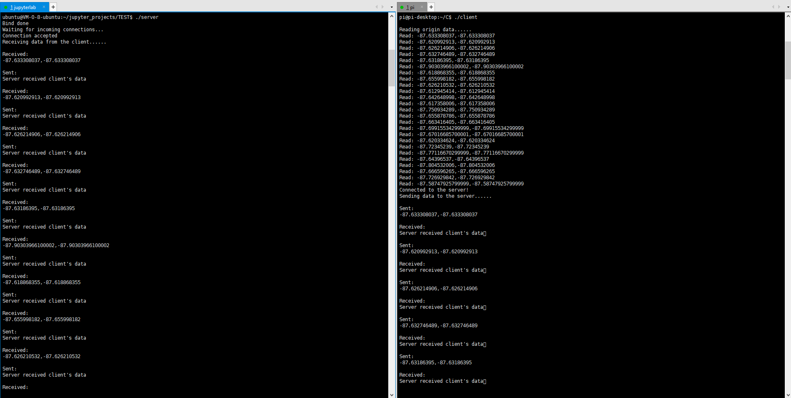
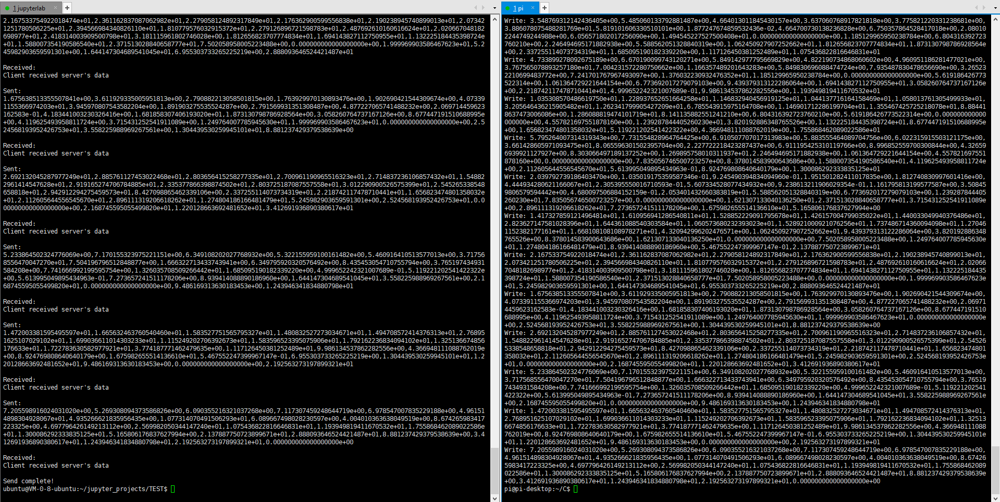
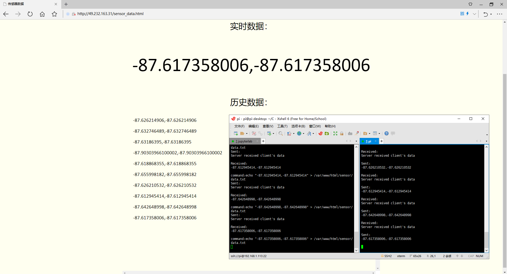
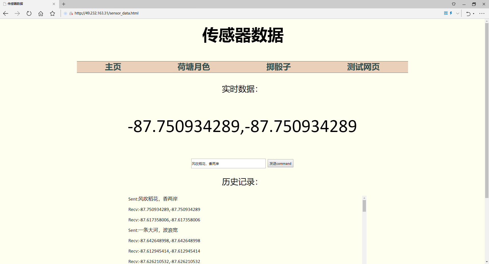

# socket通信demo    
客户机采集数据并存储在data.csv文件中，限于客户机处理能力不够，
将data.csv中的内容按行发送到服务器上，服务器接收并存储原始数据，
再调用数据处理程序处理，处理结果存储下来，服务器再将结果按行发送给客户机，
客户机接收结果并存储为result.csv。  
其中data.csv中数据为25个地点的经度纬度数据。  
服务器中数据处理程序为计算25个地点两两之间的距离的程序。  
result.csv中为结果。  

## Python实现  
服务器和客户端代码为Python程序。  

运行步骤：  
  1. 将server.py和server_process.py放在服务器上，将client.py和client_data.npy放在客户机上。  
  2. 服务器上运行命令python server.py  
  3. 客户机上运行命令python client.py  

*reference*:  
https://blog.csdn.net/qq_41427568/article/details/89049194  
## C实现  
服务器和客户端代码为C程序（可以把处理程序Python程序，对比C与Python的处理程序量，可知Python还是稍微方便一点）。  
服务器与客户机均为Linux系统。Windows下运行不了，缺失相关的头文件。  

运行步骤：  
  1. 将server.c和server_process.c放在服务器上，将client.c和data.csv放在客户机上。  
  2. 服务器上运行命令gcc server_process.c -o server_process、gcc server.c -o server和./server  
  3. 客户机上运行命令gcc client.c -o server和./client  

运行结果：  
  
  

*reference*:  
https://www.binarytides.com/socket-programming-c-linux-tutorial/  

# Web网页实时显示数据demo  
硬件条件：具有公网ip的云服务器。  
需要将html网页文件部署到服务器上，通过浏览器访问。  
demo主要分为两部分：服务器程序推送新数据和Html网页定时刷新获取新数据。  
注意：本demo的更新数据方法在本地运行会出现
*Failed to load file:///C:/xxxx: Cross origin requests are only supported for protocol schemes: http, data, chrome, chrome-extension, https.*
错误，错误源于*xmlHttp.send();*这句话，这是因为系统或者浏览器因为安全策略等原因阻止了本次操作。    

## 服务器程序推送新数据  
由refresh.c实现功能：refresh.c先获取新数据，然后拼成shell命令，最后执行shell命令将新数据写入到网页所在位置的文件中。
shell命令为  
```bash  
echo "new_data" > /var/www/html/sensor/data.txt
```  
refresh.c调起shell执行此条命令，将新数据覆盖写入到web网页所在的data.txt文件中。  
注意因为需要用字符串来拼成shell命令，所以读得的字符串需要先去掉换行符
(linux换行符为\n， windows换行符为\r\n，Mac换行符为\r)，保证拼成的shell命令格式正确，然后是C语言的字符串格式化操作。 
 
## Html网页定时刷新获取新数据  
由sensor_data.html中的JS完成刷新功能：设置setInterval函数使得客户端每间隔5秒就读取一下data.txt。  
如果当前页面中的数据与data.txt文件中的数据相同，则跳过，否则更新当前页面。  
注意读取的数据时对换行符的处理。  
  
运行步骤：  
  1. 将sensor_data.html和style.css放在服务器html文件夹内，使网页可以访问。  
  2. 将refresh.c和data.csv放在服务器的某个文件夹内。  
  3. 服务器上运行命令gcc refresh.c -o refresh和sudo ./refresh  
  4. 访问sensor_data.html所在的网页，观察效果  


# Socket和Web网页demo  
综合上面两个demo。  
客户机采集数据，通过Socket传递给服务器程序。  
服务器程序将采集到的数据推送到data.txt。
浏览器通过javascript/ajax读取data.txt的数据，并展示到Web界面中。  
浏览器通过javascript/ajax获取用户的指令，将指令数据传给服务器php脚本，由php脚本将指令数据写入到command.txt中。  
服务器程序再读取command.txt，获取到用户通过Web网页发出的指令。  
服务器程序最后将用户指令通过Socket传递给客户机。
运行步骤：  
  1. 将sensor_data.html、style.css和command.php放在服务器html文件夹内，  
     并在此建立777权限的./sensor/data.txt和./sensor/command.txt文件。  
  2. 将server.c放在服务器上，将client.c和data.csv放在客户机上。  
  3. 服务器上运行命令gcc server.c -o server和./server  
  4. 客户机上运行命令gcc client.c -o server和./client  
  5. 访问sensor_data.html所在的网页，观察效果  

效果图  
(pi黑框为树莓派客户端client.c，JupyterLab黑框为服务器端server.c)  
  
  

**改进**
1. 加入数据库，操作数据库更加安全，更优雅
2. 可以直接用服务器php脚本与客户机进行socket通信，省掉了server.c程序
  （server.c中的socket通信功能由php脚本提供，代码量更少）。  
