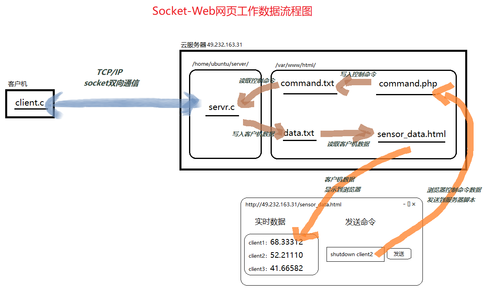

# 一、Socket demo  
完成客户机与服务器进行socket通信的demo。  
客户机将data.csv中的内容按行发送到服务器上，服务器接收并存储原始数据。
服务器再调用数据处理程序处理，得到处理结果。
服务器再将结果按行发送给客户机，客户机接收结果并存储为result.csv。  
为让程序实用，其中data.csv中数据为25个地点的经度纬度数据。result.csv中为地点之间的两两距离。  
服务器中数据处理程序为计算25个地点两两之间的距离的程序。  

## 1、Python实现  
服务器和客户端代码为Python程序。  

运行步骤：  
  1. 将server.py和server_process.py放在服务器上，将client.py和client_data.npy放在客户机上。  
  2. 服务器上运行命令python server.py  
  3. 客户机上运行命令python client.py  

*reference*:  
https://blog.csdn.net/qq_41427568/article/details/89049194  

## 2、C实现  
服务器和客户端代码为C程序。  
服务器与客户机均为Linux系统。
Windows下缺失诸如sys/socket.h、arpa/inet.h、unistd.h头文件。  

运行步骤：  
  1. 将server.c和server_process.c放在服务器上，将client.c和data.csv放在客户机上。  
  2. 服务器上运行命令gcc server_process.c -o server_process、gcc server.c -o server和./server  
  3. 客户机上运行命令gcc client.c -o server和./client  

运行结果：  
  
  

*reference*:  
https://www.binarytides.com/socket-programming-c-linux-tutorial/  

# 二、Web demo  
Web网页实时显示服务器后台发送来的数据。  
demo主要分为两部分：1、服务器程序不断生成新数据，并推送新数据到data.txt文件。
2、网页通过JS定时访问data.txt文件获取新数据，显示在网页上。  
注意：本demo的更新数据方法在本地运行会因安全策略而不能数据更新。在云服务器上运行不会。  

## 1、服务器后台程序推送新数据  
由refresh.c实现功能：refresh.c先生成新数据，然后拼成shell命令，最后执行shell命令将新数据写入到data.txt中。  
shell命令为  
```bash  
echo "new_data" > /var/www/html/sensor/data.txt
```    
注意：
	1. 文件/var/www/html/sensor/data.txt需要完全的权限，不然无法访问。  
	2. 因为需要用字符串来拼成shell命令，所以读得的字符串需要先去掉换行符
	(linux换行符为\n， windows换行符为\r\n，Mac换行符为\r)。 

## 2、网页定时刷新获取新数据  
由sensor_data.html中的JS完成刷新功能：设置setInterval函数使得客户端每间隔5秒就读取一下data.txt。  
如果当前页面中的数据与data.txt文件中的数据相同，则跳过，否则更新当前页面。  

运行步骤：  
  1. 将sensor_data.html和style.css放在服务器html文件夹内，使网页可以访问。  
  2. 将refresh.c和data.csv放在服务器的某个文件夹内。  
  3. 服务器上运行命令gcc refresh.c -o refresh和sudo ./refresh  
  4. 访问sensor_data.html所在的网页，观察效果  

运行结果：  
  

# 三、Socket、Web demo  
综合上面两个demo。  
客户机采集数据，通过Socket传递给服务器程序。  
服务器程序将采集到的数据推送到data.txt。
浏览器通过javascript/ajax读取data.txt的数据，并展示到Web界面中。  
浏览器通过javascript/ajax获取用户的指令，将指令数据传给服务器php脚本，由php脚本将指令数据写入到command.txt中。  
服务器程序再读取command.txt，获取到用户通过Web网页发出的指令。  
服务器程序最后将用户指令通过Socket传递给客户机。  
  

运行步骤：  
  1. 将sensor_data.html、style.css和command.php放在服务器html文件夹内，  
     并在此建立777权限的./sensor/data.txt和./sensor/command.txt文件。  
  2. 将server.c放在服务器上，将client.c和data.csv放在客户机上。  
  3. 服务器上运行命令gcc server.c -o server和./server  
  4. 客户机上运行命令gcc client.c -o server和./client  
  5. 访问sensor_data.html所在的网页，观察效果  

运行结果：  
(pi黑框为树莓派客户端client.c，JupyterLab黑框为服务器端server.c)  
  
  

# 四、Mysql demo  
出错参考：  
1. https://www.cnblogs.com/cpl9412290130/p/9583868.html  
2. https://blog.csdn.net/qq_32266237/article/details/52643876   
3. https://blog.csdn.net/jiangzhanweiabc/article/details/79805294  

**SQL基础命令**
创建数据库  
```sql  
create database place
```  
选择数据库  
```sql  
use place
```  
创建数据表  
```sql  
create table data( no int unsigned auto_increment, name varchar(10) not null, lon float, lat float, primary key(no) )charset=utf8;
```  
插入记录  
```sql  
insert into data (name, lon, lat) values ('pc', 87.585, -42.156);
```  
取出所有记录  
```sql  
select * from data;
```  
取出最后一条记录  
```sql  
select * from data order by no desc limit 1;
```  
取出最后一条记录的no字段的值  
```sql  
select no from command order by no desc limit 1;
```  
删除no在(2, 6)之间的记录  
```sql  
delete from data where no>2 and no<6
```  

## 1、Python连接Mysql  
结合了socket通信的代码。  
服务器端代码接收数据并将数据存储到数据库中。  

运行步骤：  
  1. 将server.py放在服务器上，将client.py放在客户机上。  
  2. 服务器上运行命令python server.py  
  3. 客户机上运行命令python client.py  

## 2、C连接Mysql  
makefile中指定mysqlclient库。必要时指定头文件目录。  
```bash  
c_mysql:c_mysql.c
	gcc c_mysql.c -o c_mysql -lmysqlclient
```  

## 3、php连接Mysql  
data.php脚本读取数据库中的data表最新一行数据，并显示在网页上。  
command.php获取网页上用户输入，并存储在数据库中的command数据表中。  

运行步骤：  
  1. 将data.php、command.php、sensor_data.html和style.css放在服务器html文件夹内，使网页可以访问。  
  2. 浏览器中访问sensor_data.html，并观察和操作。  
  3. 登录Mysql数据库观察变化。  

运行结果：  
  

# 五、Socket, Mysql and Web demo  
综合上面的内容，并在服务器端多进程支持多客户机同时通信。  
多客户机采集数据，通过Socket传递给服务器C程序。  
服务器C程序将采集到的数据存储到Mysql数据库的data数据表中。
浏览器通过php脚本data.php读取Mysql数据库的data数据表的数据，并展示到Web界面中。  
浏览器通过php脚本command.php将用户指令存储到Mysql数据库的command数据表中。  
服务器C程序再读取command数据表，获取到用户通过Web网页发出的指令。  
服务器C程序最后将用户指令通过Socket传递给多客户机。  
  

运行步骤：  
  0. 建立数据库。
  1. 将sensor_data.html、style.css和data.php、command.php放在服务器html文件夹内。 
  2. 将server.c放在服务器上，将client.c和data.csv放在多个不同的客户机上。  
  3. 服务器上运行命令gcc server.c -o server和./server  
  4. 多客户机运行命令gcc client.c -o server和./client  
  5. 访问sensor_data.html所在的网页，观察效果  

运行结果： 
(左黑框为服务器端server.c，中黑框为Mysql数据库，右黑框为树莓派客户端client.c，)  
  
  


